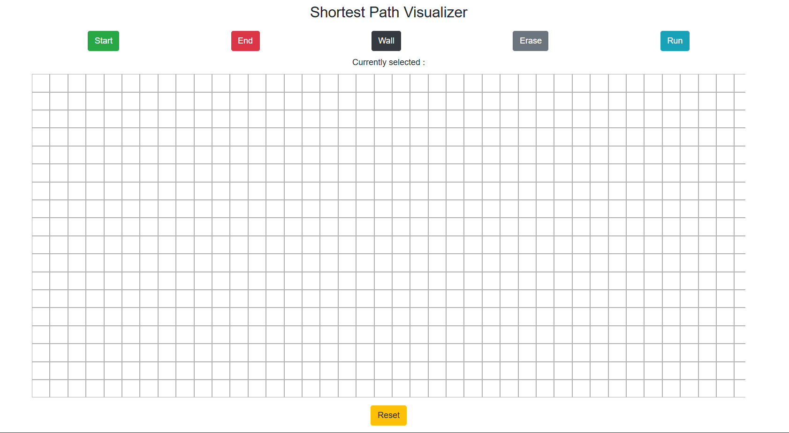
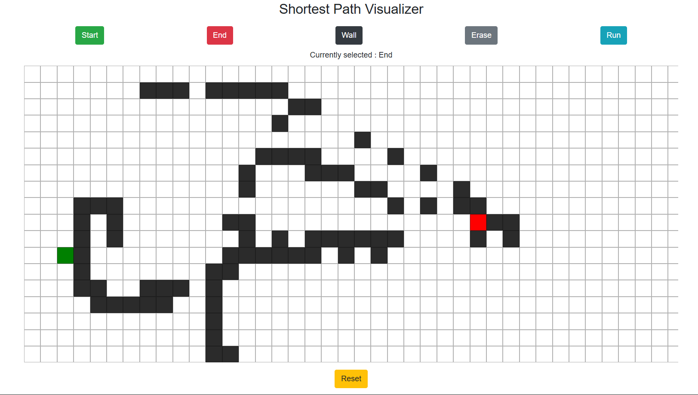
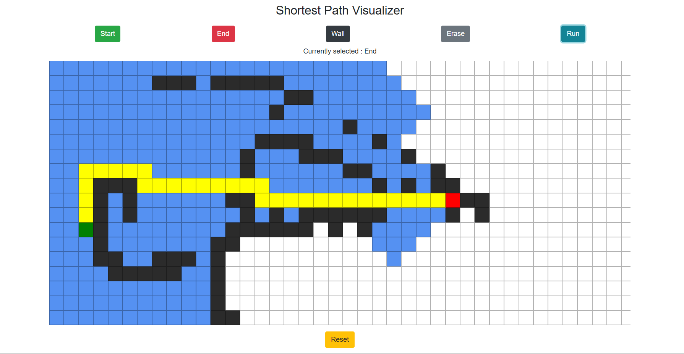

# 🧭 Pathfinder


## 📌 Project Overview
Pathfinder is an interactive web-based shortest path visualizer built using HTML, CSS, and JavaScript. It allows users to create obstacles, set start and end points, and visualize how a pathfinding algorithm explores the grid and determines the shortest path.

This project demonstrates fundamental concepts in graph traversal and algorithm visualization in a simple and intuitive way.

---

## 🎥 Preview

<p>
  <b>Grid Setup</b><br>
  <br><br>

  <b>Assign Wall, Start, and End Nodes</b><br>
  <br><br>

  <b>Final Shortest Path</b><br>
  
</p>

---

## 🚀 Features
- Interactive grid system
- Place **Start** and **End** nodes
- Draw and erase **walls/obstacles**
- Visualize pathfinding step-by-step
- Animated visited nodes
- Highlighted shortest path
- Reset board functionality

---

## ⚙️ How It Works
The application represents the grid as a graph where each cell acts as a node.

### Algorithm Flow:
1. Start from the **Start node**
2. Explore neighboring cells
3. Mark visited nodes
4. Continue until reaching the **End node**
5. Reconstruct the **shortest path**

The current implementation uses:
- **Breadth-First Search (BFS)** → guarantees the shortest path in an unweighted grid

---

## 🛠️ Tech Stack
- **HTML** – structure
- **CSS** – styling & layout
- **JavaScript** – logic & interactivity

---

## 📂 Project Structure
```text
pathfinder/
│
├── index.html          # Main UI
├── styles.css          # Styling
└── js/
    └── script.js       # Pathfinding logic
└── images/
    └── 1.png
    └── 2.png
    └── 3.png
